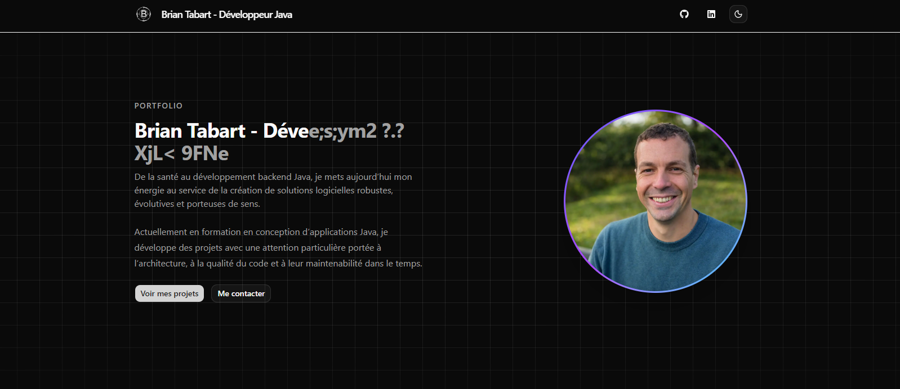

# Portfolio — Brian Tabart



Portfolio personnel de Brian Tabart, développeur backend Java en reconversion depuis le milieu de la santé. Conçu pour présenter mes projets, mon parcours et ma stack technique.

## Stack

- **Framework** : Next.js 15 — App Router, React Server Components
- **Langage** : TypeScript 5
- **Style** : Tailwind CSS v4 (configuration via `globals.css`, sans `tailwind.config.ts`)
- **UI** : shadcn/ui
- **Animations** : Framer Motion
- **Email** : Resend
- **Rate limiting** : Upstash Redis
- **Déploiement** : Vercel

## Lancer le projet en local

```bash
npm install
npm run dev
```

Ouvrir [http://localhost:3000](http://localhost:3000).

## Variables d'environnement

Créer un fichier `.env.local` à la racine :

```env
RESEND_API_KEY=
CONTACT_TO_EMAIL=
CONTACT_FROM_EMAIL=
UPSTASH_REDIS_REST_URL=
UPSTASH_REDIS_REST_TOKEN=
```

| Variable | Description |
|---|---|
| `RESEND_API_KEY` | Clé API Resend pour l'envoi d'emails |
| `CONTACT_TO_EMAIL` | Email qui reçoit les messages du formulaire |
| `CONTACT_FROM_EMAIL` | Email expéditeur (doit être vérifié sur Resend) |
| `UPSTASH_REDIS_REST_URL` | URL REST de la base Upstash Redis |
| `UPSTASH_REDIS_REST_TOKEN` | Token d'authentification Upstash |

## Structure du projet

```
src/
├── app/
│   ├── api/contact/       Route API — envoi d'email + rate limiting
│   ├── projects/[slug]/   Pages projets dynamiques
│   ├── globals.css        Thème Tailwind v4 (couleurs, typographie, animations)
│   └── layout.tsx
├── components/
│   ├── layout/            Navbar, header, footer, conteneurs
│   ├── sections/          Sections de la page (hero, parcours, projets, stack, contact…)
│   └── ui/                Composants shadcn/ui et composants custom
├── data/                  Données statiques (projets, livres, parcours, technologies)
└── lib/                   Utilitaires, template email, rate limiting
```

## Déploiement

Le projet est déployé sur Vercel. Les variables d'environnement sont à configurer dans le dashboard Vercel avant le premier déploiement.
